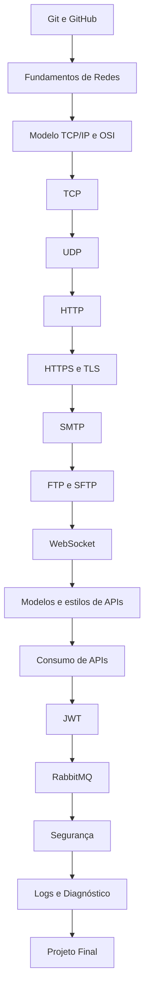

# Trilha Python — Redes e Comunicação em Desenvolvimento de Software

Repositório com exercícios e projetos práticos de uma trilha de estudos autodidata, focada em entender como sistemas modernos se comunicam: redes, protocolos, APIs e integração entre serviços.

## Sobre

A trilha é estruturada em módulos progressivos, começando pelos fundamentos de redes e avançando por protocolos de transporte e aplicação até tópicos como autenticação, mensageria e segurança. A implementação dos exercícios aqui é feita em **Python**.

Cada pasta representa um módulo estudado e contém seu próprio código e, quando aplicável, um README específico com mais detalhes sobre aquele tópico.

## Estrutura da trilha

## Progresso atual

Módulos já implementados neste repositório:

- **Fundamentos de Redes** — conceitos básicos, utilitários de rede e ping
- **TCP** — comunicação cliente-servidor usando sockets TCP
- **UDP** — comunicação cliente-servidor usando sockets UDP
- **HTTP** — construção de uma API simples, com schemas e rotas
- **SMTP** — envio de emails, com uma pequena interface front-end
- **FTP e SFTP** — upload e download de arquivos

Os demais módulos (HTTPS/TLS, WebSocket, modelos de API, JWT, RabbitMQ, segurança, logs/diagnóstico e o projeto final) ainda serão adicionados conforme avanço na trilha.

## Tecnologias

- Python
- Bibliotecas nativas de rede (`socket`, `smtplib`, `ftplib`, etc.)

## Observações

Este é um repositório de estudos, com foco em aprendizado prático. O código pode não seguir todas as boas práticas de produção e está em constante evolução conforme avanço na trilha.
